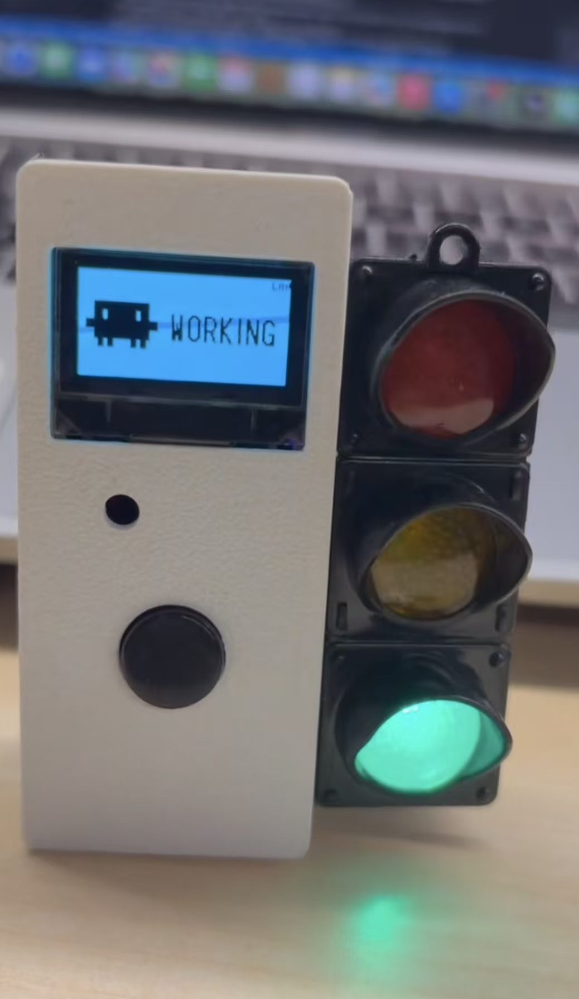

# signal_light_demo

在 **TUYA T5AI CORE** 开发板上实现的桌面「AI 编程助手」硬件伴侣：抬头看灯/屏即知 Cursor Agent 在干什么，长按说话即可把听写文字注入 Mac 当前输入框。

## 实物展示



> **3D 模型文件**：核心板红绿灯外壳的 3D 模型位于 [`source/embedded/doc/`](source/embedded/doc/)：
> - 渲染预览：[`source/embedded/doc/3D模型.png`](source/embedded/doc/3D模型.png)
> - STEP 源文件：[`source/embedded/doc/核心板红绿灯.step`](source/embedded/doc/核心板红绿灯.step)

---

| 能力 | 说明 |
|------|------|
| **状态灯** | 绿 / 黄 / 红 LED，与 Cursor / Claude Code 生命周期联动 |
| **状态屏** | 128×64 SSD1306 OLED：Agent 状态 + 活跃链路标签 |
| **云端听写** | P29 长按 → 涂鸦云端 Agent → **AI 回复文字**发到 PC 输入框 |
| **P17 外接键** | **单击** → Mac 热键；**双击** → 回车；**长按** → 云端按住说话 |
| **语音热键** | P17 单击 → Mac 注入 `Ctrl+Fn`（可配置） |
| **PC 桥接** | 默认 **局域网 WebSocket**；可切回 UART 串口 |

固件基于 `TuyaOpenSDK/tools/app_template/base` 脚手架，源码在 `source/embedded/`。

---

## 硬件接线（T5AI CORE）

| 引脚 / 接口 | 功能 | 备注 |
|-------------|------|------|
| GPIO 5 / 6 / 7 | 绿 / 黄 / 红 LED | 低电平亮 |
| GPIO 14 / 15 (I2C) | SSD1306 OLED | 地址 `0x3C` |
| **P29** (`ai_chat_button`) | 云端 Agent 语音 | 长按说话（板载键，封装后可能被遮挡） |
| **P17** | 外接按键（TDL 驱动） | **单击** = Mac 热键；**双击** = 回车；**长按 ≥400ms** = 云端按住说话 |
| USB 口 **8421** @ 115200 | UART0 桥接（回退通道） | 与 `tal_cli` 共用 |
| USB 口 **8423** @ 460800 | 调试日志 | `tos.py monitor`，勿占作桥接 |

设备与 Mac/PC 需在同一 Wi-Fi 下使用默认 **WS 模式**。

---

## Agent 状态

| 状态 | LED | OLED 主行 |
|------|-----|-----------|
| `idle` | 绿灯常亮 | `IDLE`；空闲 **1 分钟** 后显示本地 `HH:MM`（需时间已同步） |
| `working` | 绿→黄→红 慢循环 | `WORKING` |
| `attention` | 黄灯闪烁 | `ATTENTION` |
| `urgent` | 红灯快闪 + 屏边框 | `URGENT` |

OLED 左上角为助手图标，右上角显示当前活跃链路：`LAN`（WebSocket）或 `UART`。断连 **1 分钟后** 右上角显示 `DISCONN`，主行仍显示 Agent 状态或时钟。

---

## 快速开始

### 1. 编译与烧录固件

```bash
cd source/embedded
tos.py check
tos.py build
tos.py flash
```

### 2. 启动 PC 桥接（设备自动发现 PC IP）

在项目根目录：

```bash
./tools/run_bridge.sh
```

脚本会：
- 启动 WebSocket 服务（`8765`）
- **每 2 秒 UDP 广播**桥接地址（`8766`），设备收到后自动连接，**无需再改固件 IP**

`CONFIG_SIGNAL_BRIDGE_HOST` 仅作回退：发现超时未收到广播时才使用。

同步可选修改 `tools/signal_bridge_config.json`：

```json
"discovery_enabled": true,
"discovery_port": 8766,
"discovery_interval_ms": 2000
```

### 3. 设备配网

首次使用通过涂鸦 Smart Life App 为设备配网；联网后云端同步时间，OLED 空闲时钟才可用。

### 4. Cursor Hooks（状态灯联动）

项目已包含 `.cursor/hooks.json`。在 **本仓库根目录** 用 Cursor 打开项目后，Agent 生命周期事件会自动推送到设备。

> 桥接进程由 `run_bridge.sh` 独占；Hook 脚本只推送状态，不会重复占用串口。

---

## 传输通道

| 模式 | 方向 | 适用场景 |
|------|------|----------|
| **ws**（默认） | 设备 → Mac `ws://IP:8765/device` | 同 WiFi，不占 USB 串口 |
| **uart** | USB 8421 @ 115200 | 无局域网或调试 |
| **ble** | 实验性 | 默认关闭（与涂鸦配网 BLE 冲突） |

切换方式：

```bash
python3 tools/signal_transport_switch.py ws    # 或 uart
python3 tools/signal_transport_switch.py status
```

也可环境变量覆盖：`export SIGNAL_BRIDGE_TRANSPORT=uart`，然后重启 `run_bridge.sh`。

优先级（固件）：**WS > UART**（WS 连接且活跃时优先）。

---

## PC 桥接配置

`tools/signal_bridge_config.json` 主要字段：

| 字段 | 说明 |
|------|------|
| `transport` | `ws` / `uart` / `ble` / `auto` |
| `ws_listen_host` / `ws_listen_port` | WS 服务监听（默认 `0.0.0.0:8765`） |
| `discovery_enabled` | 是否 UDP 广播 PC IP（默认 `true`） |
| `discovery_port` / `discovery_interval_ms` | 发现端口与广播间隔（默认 `8766` / `2000ms`） |
| `device_bridge_host` | 文档用回退 IP，与固件 `CONFIG_SIGNAL_BRIDGE_HOST` 一致即可 |
| `uart_port` | macOS 如 `/dev/cu.wchusbserial…8421` |
| `voice_input_mode` | `asr` / `hotkey` / `both`（推荐 `both`） |
| `voice_hotkey` | Mac 热键，默认 `ctrl+fn` |
| `enter_hotkey` | P17 双击注入的回车，默认 `enter`；Cursor 审批可试 `cmd+enter` |
| `keepalive_interval_ms` | 空闲时周期性 `idle` 保活 |

---

## 设备 ↔ PC 协议（文本行）

每行以 `\n` 结束，经 WS 或 UART 传输。

| 方向 | 示例 | 含义 |
|------|------|------|
| PC → 局域网 UDP | `SIGNAL_BRIDGE ip=172.16.28.66 port=8765` | 桥接发现广播（`:8766`） |
| PC → 设备 | `SIGNAL working\n` | 设置 Agent 状态 |
| PC → 设备 | `idle` / `working` / … | 简写（keepalive） |
| 设备 → PC | `ASR <AI回复文本>\n` | P29 云端对话完成后注入 NLG 全文 |
| 设备 → PC | `VOICE down\n` / `VOICE up\n` | P17 **单击**热键脉冲 |
| 设备 → PC | `KEY enter\n` | P17 **双击**回车 |

设备 CLI（经调试口或 UART0 `tal_cli`）：

```text
SIGNAL working
signal set attention
```

---

## 项目结构

```
signal_light_demo/
├── .cursor/hooks.json          # Cursor Agent → 状态灯 Hook
├── .tuyaopen/                  # IDE 元数据、板级 spec、产品快照
├── source/
│   ├── embedded/               # 固件（在此 build / flash）
│   │   ├── src/
│   │   │   ├── tuya_main.c           # 入口、IoT、模块初始化
│   │   │   ├── agent_status.c        # 状态模型
│   │   │   ├── signal_led.c          # LED 图案
│   │   │   ├── signal_oled.c         # OLED UI + 空闲时钟
│   │   │   ├── signal_transport.c    # UART / WS 统一收发
│   │   │   ├── signal_ws.c           # LAN WebSocket 客户端
│   │   │   ├── signal_discovery.c    # UDP 发现 PC 桥接
│   │   │   ├── signal_voice_key.c    # P17 热键
│   │   │   └── app_chat_bot.c        # P29 云端 ASR
│   │   ├── include/signal_config.h   # 引脚、超时、桥接地址
│   │   └── app_default.config        # Kconfig 默认值
│   └── miniapp/                # 面板占位
├── tools/
│   ├── run_bridge.sh / run_bridge.bat   # 入口：安装依赖 + 启动桥接
│   ├── signal_bridge_config.json        # 传输/串口/热键/发现 配置
│   ├── requirements-bridge.txt
│   │
│   ├── signal_bridge_run.py             # 桥接启动器（run_bridge 调用）
│   ├── cursor_signal_keepalive.py       # 核心守护：WS/UART + ASR/热键注入
│   ├── cursor_signal_hook.py            # Cursor Hook → 推状态
│   ├── cursor_signal_bridge.py          # CLI 手动推状态 / BLE 扫描
│   │
│   ├── signal_ws_server.py              # WebSocket 服务端
│   ├── signal_discovery.py              # UDP 发现广播
│   ├── bridge_transport.py              # ws/uart/ble 模式解析
│   ├── uart_ipc.py                      # Hook → 守护进程 Unix socket
│   ├── signal_transport_switch.py       # 切换 transport 配置
│   ├── signal_bridge_log.py             # 统一日志
│   │
│   ├── mac_text_inject.py               # Mac 文本注入（剪贴板+Cmd+V）
│   ├── mac_hotkey_inject.py             # Mac 热键注入（P17）
│   └── signal_mock_client.py            # UART 调试：模拟 PC 发 SIGNAL
├── tuyaopen.project.ini
└── README.md
```

---

## 常用命令

```bash
# 固件
cd source/embedded && tos.py build && tos.py flash

# 串口日志（调试口 460800，勿与桥接串口混淆）
cd source/embedded && tos.py monitor

# PC 桥接
./tools/run_bridge.sh

# 模拟 PC 发状态（UART 调试）
python3 tools/signal_mock_client.py working
```

---

## 故障排查

| 现象 | 检查 |
|------|------|
| OLED 右上角无 `LAN` | 是否同 WiFi、`run_bridge.sh` 是否在跑、发现是否开启 |
| 一直显示 `IDLE` 不显示时间 | 是否联网且 NTP/云端时间已同步；是否空闲满 1 分钟 |
| ASR 不进输入框 | `voice_input_mode` 是否为 `both` 或 `asr`；桥接日志是否有 `ASR` |
| P17 热键无效 | `voice_input_mode` 含 `hotkey`；Mac 辅助功能是否允许输入模拟 |
| UART 占用 | 关闭其他占用 8421 的进程；或改用 `transport: ws` |
| Hook 无反应 | 是否从本仓库根目录打开 Cursor；`run_bridge.sh` 是否已启动 |

---

## 参考

- AI Agent 开发说明：[`AGENTS.md`](AGENTS.md)
- 板级引脚与保留 GPIO：`.tuyaopen/ide/platform.json`、`.tuyaopen/ide/board.json`
- Mini App：`source/miniapp/README.md`

